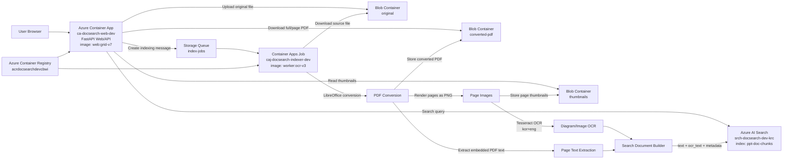
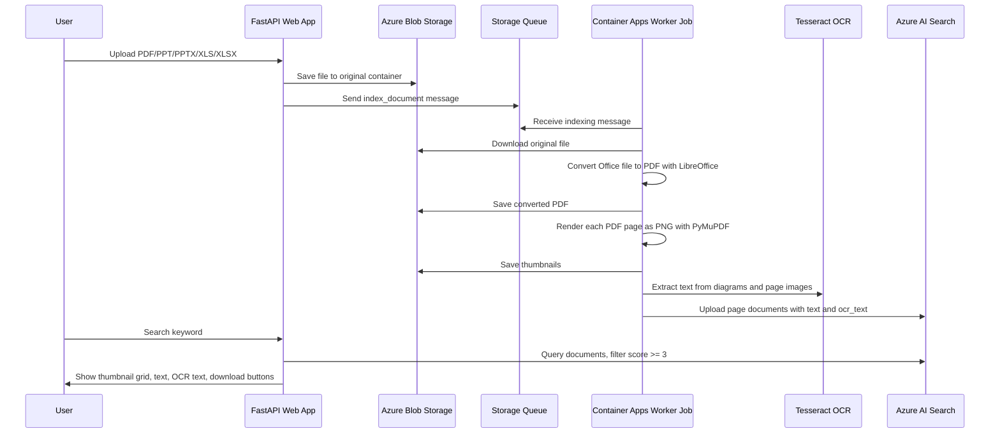

# Azure AI RAG Document Search Test 02

This repository contains an Azure-based RAG document search sample for PDF, PowerPoint, and Excel files.

The system uploads documents to Azure Blob Storage, queues indexing work, converts office files to PDF, generates page thumbnails, extracts page text and OCR text from diagrams/images, and indexes the result into Azure AI Search. The web application provides a thumbnail grid search UI with score filtering, document text, diagram/OCR text, full-PDF download, and single-page PDF download.

## Current Deployment Summary

| Item | Value |
|---|---|
| Azure region | `koreacentral` |
| Resource group | `rg-docsearch-dev-krc` |
| Web app | `ca-docsearch-web-dev` |
| Web URL | `https://ca-docsearch-web-dev.yellowplant-b363768d.koreacentral.azurecontainerapps.io` |
| Web container image | `acrdocsearchdevcbwi.azurecr.io/ppt-docsearch-web:grid-v7` |
| Worker job | `caj-docsearch-indexer-dev` |
| Worker container image | `acrdocsearchdevcbwi.azurecr.io/ppt-docsearch-worker:ocr-v3` |
| Azure Container Registry | `acrdocsearchdevcbwi.azurecr.io` |
| Storage account | `stdocsearchdevcbwi` |
| Queue | `index-jobs` |
| Azure AI Search service | `srch-docsearch-dev-krc` |
| Azure AI Search index | `ppt-doc-chunks` |
| Azure OpenAI endpoint | `https://aoai-docsearch-dev-krc-cbwi.openai.azure.com/` |
| Embedding deployment | `text-embedding-3-small` |
| Chat deployment | `gpt-4o-mini` |

## Architecture



## End-to-End Flow



## OCR Support for Diagrams and Images


The worker includes OCR processing so that text embedded in architecture diagrams, screenshots, scanned slides, or image-only page areas can be indexed and displayed.

Implementation details:

| Step | Description |
|---|---|
| PDF rendering | Each page is rendered to PNG with PyMuPDF. |
| OCR engine | Tesseract OCR is installed in the worker image. |
| OCR languages | Korean and English: `kor+eng`. |
| OCR mode | `--psm 6` is used for block-like page text extraction. |
| Search field | OCR output is stored in the `ocr_text` field. |
| UI display | The search card shows both `Document Text` and `Diagram/OCR Text`. |

The OCR-capable worker image is:

```text
acrdocsearchdevcbwi.azurecr.io/ppt-docsearch-worker:ocr-v3
```

The worker Dockerfile installs:

```text
libreoffice
poppler-utils
fonts-noto-cjk
tesseract-ocr
tesseract-ocr-eng
tesseract-ocr-kor
```

## Azure Resources

### Resource Group

| Resource | Purpose |
|---|---|
| `rg-docsearch-dev-krc` | Main resource group for the dev environment. |

### Azure Container Registry

| Resource | Purpose |
|---|---|
| `acrdocsearchdevcbwi` | Stores the web and worker container images. |
| `ppt-docsearch-web:grid-v7` | FastAPI web application image. |
| `ppt-docsearch-worker:ocr-v3` | OCR-enabled indexing worker image. |

### Azure Container Apps

| Resource | Purpose |
|---|---|
| `ca-docsearch-web-dev` | Public FastAPI web application. |
| `caj-docsearch-indexer-dev` | Queue-triggered worker job for indexing. |
| Container Apps Environment | Hosts the web app and worker job. |
| Log Analytics Workspace | Stores Container Apps logs. |

The web application exposes:

| Route | Description |
|---|---|
| `/` | Upload and search page. |
| `/healthz` | Health check endpoint. |
| `/upload` | Uploads source files to Blob Storage and queues indexing. |
| `/search?q=<keyword>` | Shows search results in a thumbnail grid. |
| `/thumb/{file_id}/{page_no}` | Streams a private page thumbnail. |
| `/pdf/{file_id}` | Downloads the full converted PDF. |
| `/pdf/{file_id}/page/{page_no}` | Downloads only the selected page as a one-page PDF. |

### Azure Storage

Storage account:

```text
stdocsearchdevcbwi
```

Containers and queue:

| Name | Type | Purpose |
|---|---|---|
| `original` | Blob container | Stores uploaded source documents. |
| `converted-pdf` | Blob container | Stores converted PDF files. |
| `thumbnails` | Blob container | Stores page thumbnail PNG files. |
| `index-jobs` | Storage Queue | Stores document indexing jobs. |

Storage security settings:

| Setting | Value |
|---|---|
| Replication | Standard LRS |
| Minimum TLS | TLS 1.2 |
| Blob public access | Disabled |
| Containers | Private |
| Blob versioning | Enabled |
| Delete retention | 7 days |

### Azure AI Search

| Resource | Value |
|---|---|
| Search service | `srch-docsearch-dev-krc` |
| SKU | `basic` |
| Semantic search SKU | `free` |
| Index | `ppt-doc-chunks` |
| Authentication mode | API key and Microsoft Entra ID RBAC |

Important index fields:

| Field | Purpose |
|---|---|
| `id` | Unique page chunk document key. |
| `file_id` | Uploaded file identifier. |
| `file_name` | Original file name. |
| `file_ext` | File extension. |
| `page_no` | Page number. |
| `slide_no` | Slide number for presentation files. |
| `title` | Document title. |
| `text` | Text extracted from the PDF/page. |
| `ocr_text` | Text extracted from rendered page images and diagrams. |
| `image_caption` | Reserved for image captions. |
| `source_blob_url` | Original source Blob URL. |
| `pdf_blob_url` | Converted PDF Blob URL. |
| `thumb_blob_url` | Thumbnail Blob path. |
| `updated_at` | Last indexing timestamp. |
| `content_vector` | Vector field with 1536 dimensions. |

Search behavior:

- Keyword search is performed against Azure AI Search.
- Search results with score lower than `3` are hidden in the UI.
- Semantic configuration includes `text`, `ocr_text`, and `image_caption`.
- The UI shows document text and diagram/OCR text separately.

### Azure OpenAI

| Resource | Value |
|---|---|
| Account | `aoai-docsearch-dev-krc-cbwi` |
| Endpoint | `https://aoai-docsearch-dev-krc-cbwi.openai.azure.com/` |
| Embedding model | `text-embedding-3-small` |
| Embedding dimensions | `1536` |
| Chat model | `gpt-4o-mini` |

### Managed Identity and RBAC

The web app and worker use user-assigned managed identities.

Typical permissions:

| Target | Web App | Worker Job |
|---|---|---|
| Blob Storage | Read/write upload and download data | Read original, write PDFs and thumbnails |
| Storage Queue | Send indexing messages | Receive and delete indexing messages |
| Azure AI Search | Query index | Upload/update documents |
| ACR | Pull web image | Pull worker image |

## Repository Layout

```text
azure_ai_01/
├── app/
│   ├── main.py
│   │   ├── FastAPI web app
│   │   ├── file upload
│   │   ├── search result grid
│   │   ├── thumbnail streaming
│   │   ├── full PDF download
│   │   ├── single-page PDF download
│   │   └── document text + diagram/OCR text display
│   └── workers/
│       └── index_worker.py
│           ├── queue message processing
│           ├── source Blob download
│           ├── LibreOffice PDF conversion
│           ├── thumbnail generation
│           ├── Tesseract OCR
│           └── Azure AI Search indexing
├── docker/
│   ├── Dockerfile.web
│   └── Dockerfile.worker
├── envs/
│   └── dev/
│       ├── main.tf
│       ├── variables.tf
│       ├── outputs.tf
│       ├── terraform.tfvars
│       ├── terraform.tfvars.example
│       ├── search_index.tf
│       └── generated_search_index_payload.json
├── modules/
│   ├── acr/
│   ├── container_apps/
│   ├── identities/
│   ├── keyvault/
│   ├── openai/
│   ├── rbac/
│   ├── resource_group/
│   ├── search/
│   └── storage/
├── scripts/
│   ├── create_search_index.sh
│   └── search_index_payload.json.tpl
├── requirements-web.txt
├── requirements-worker.txt
└── README.md
```

## Key Files

| File | Description |
|---|---|
| `app/main.py` | Web API and HTML UI. |
| `app/workers/index_worker.py` | Queue-triggered document indexing worker. |
| `docker/Dockerfile.web` | Web container image build definition. |
| `docker/Dockerfile.worker` | Worker image build definition with LibreOffice and OCR packages. |
| `requirements-web.txt` | Python dependencies for the web app. |
| `requirements-worker.txt` | Python dependencies for the worker. |
| `envs/dev/main.tf` | Dev environment Terraform root module. |
| `envs/dev/terraform.tfvars` | Current dev configuration values. |
| `envs/dev/search_index.tf` | Search index creation hook. |
| `scripts/search_index_payload.json.tpl` | Azure AI Search index schema template. |

## Prerequisites

- Azure CLI
- Terraform 1.7 or later
- Docker
- Azure subscription with access to:
  - Azure Container Apps
  - Azure Container Registry
  - Azure Storage
  - Azure AI Search
  - Azure OpenAI

## Terraform Deployment

```bash
cd envs/dev

az login
az account set --subscription "<SUBSCRIPTION_ID>"

terraform init
terraform validate
terraform plan -out tfplan
terraform apply tfplan
```

The current image settings in `envs/dev/terraform.tfvars` are:

```hcl
use_acr_images = true

web_image    = "acrdocsearchdevcbwi.azurecr.io/ppt-docsearch-web:grid-v7"
worker_image = "acrdocsearchdevcbwi.azurecr.io/ppt-docsearch-worker:ocr-v3"
```

## Build and Push Images

```bash
ACR_NAME="acrdocsearchdevcbwi"
ACR_LOGIN_SERVER="acrdocsearchdevcbwi.azurecr.io"

az acr login --name "$ACR_NAME"

docker build \
  -f docker/Dockerfile.web \
  -t "$ACR_LOGIN_SERVER/ppt-docsearch-web:grid-v7" \
  .

docker push "$ACR_LOGIN_SERVER/ppt-docsearch-web:grid-v7"

docker build \
  -f docker/Dockerfile.worker \
  -t "$ACR_LOGIN_SERVER/ppt-docsearch-worker:ocr-v3" \
  .

docker push "$ACR_LOGIN_SERVER/ppt-docsearch-worker:ocr-v3"
```

## Update Running Container Apps

```bash
az containerapp update \
  -g rg-docsearch-dev-krc \
  -n ca-docsearch-web-dev \
  --image acrdocsearchdevcbwi.azurecr.io/ppt-docsearch-web:grid-v7
```

```bash
az containerapp job update \
  -g rg-docsearch-dev-krc \
  -n caj-docsearch-indexer-dev \
  --image acrdocsearchdevcbwi.azurecr.io/ppt-docsearch-worker:ocr-v3
```

## Manually Start the Worker

The worker is queue-triggered, but it can also be started manually:

```bash
az containerapp job start \
  -g rg-docsearch-dev-krc \
  -n caj-docsearch-indexer-dev
```

Check worker logs:

```bash
az containerapp job logs show \
  -g rg-docsearch-dev-krc \
  -n caj-docsearch-indexer-dev \
  --container indexer \
  --tail 200
```

## Upload and Search

Open the web application:

```text
https://ca-docsearch-web-dev.yellowplant-b363768d.koreacentral.azurecontainerapps.io
```

Supported upload formats:

- PDF
- PPT
- PPTX
- XLS
- XLSX

Search example:

```text
https://ca-docsearch-web-dev.yellowplant-b363768d.koreacentral.azurecontainerapps.io/search?q=OKTA
```

The result page shows:

- Thumbnail grid
- Page number
- Search score
- Document text
- Diagram/OCR text
- Full PDF download button
- Single-page PDF download button

## Verify OCR Data in Azure AI Search

```bash
SEARCH_KEY=$(az search admin-key show \
  -g rg-docsearch-dev-krc \
  --service-name srch-docsearch-dev-krc \
  --query primaryKey \
  -o tsv)

curl -sS \
  -H "api-key: $SEARCH_KEY" \
  "https://srch-docsearch-dev-krc.search.windows.net/indexes/ppt-doc-chunks/docs?api-version=2025-09-01&search=*&\$select=file_name,page_no,text,ocr_text&\$top=3"
```

## Notes

- Existing documents must be reprocessed to populate the `ocr_text` field.
- The UI currently hides results with a search score lower than `3`.
- The single-page PDF download endpoint dynamically extracts one page from the converted PDF.
- Private Blob containers are accessed through the web application using managed identity.
- Azure OpenAI model availability depends on region, quota, and subscription approval status.
 
